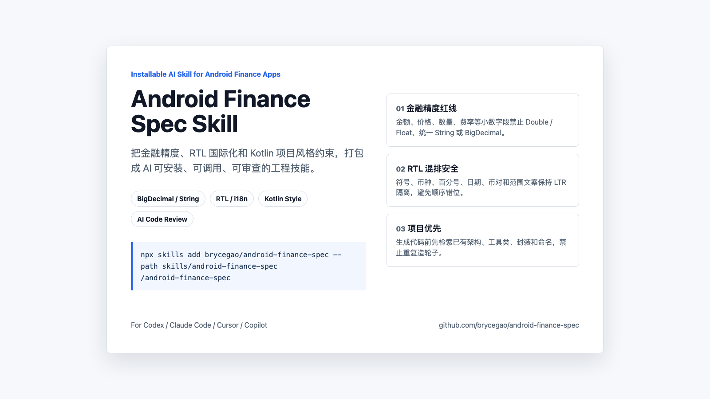

# Android Finance Spec Skills
> Android 金融 App 缺失的 AI 编码标准：金融精度安全、RTL / 国际化 UI、安全复用项目既有 Kotlin 风格。

**语言:** [English](./README.md) | 简体中文




## Skills

| Skill | 说明 | 安装 |
|-------|------|------|
| [**Android Finance Spec**](./skills/android-finance-spec/) | 为 Android Kotlin 金融代码提供 BigDecimal / String 精度、RTL / 国际化安全和项目优先 Kotlin 风格约束 | `npx skills add brycegao/android-finance-spec --path skills/android-finance-spec` |

## 快速开始

安装任意 skill：

```bash
npx skills add brycegao/android-finance-spec --path skills/<skill-name>
```

`npx` 会临时运行 npm 上的 `skills` CLI。真正解析 `brycegao/android-finance-spec` 的是 `skills` CLI，它会把 `owner/repo` 解析为 GitHub 仓库，再通过 `--path` 安装指定 skill 目录。

安装本 skill：

```bash
npx skills add brycegao/android-finance-spec --path skills/android-finance-spec
```

安装后在 Agent 终端中调用：

```bash
/android-finance-spec    # Review 当前 Android Kotlin 改动
```

slash 调用依赖你的 Agent 终端和 `skills` CLI 集成。如果当前终端不支持 slash command，请使用下面的对话式调用。

也可以在对话中直接点名 Skill：

```text
Use $android-finance-spec to review this Android Kotlin change for finance precision, RTL/i18n, and project style risks.
```

## 能检查什么

- 金融小数字段使用 `Double` / `Float`
- 不安全的 `BigDecimal` 构造和 `.toDouble()` / `.toFloat()` 转换
- 手写金融格式化，而不是统一格式化工具
- XML 中使用 `left` / `right` 导致 RTL 布局问题
- `+/-`、`%`、币对、日期、范围、单位等 RTL 混排风险
- Android XML 中硬编码用户可见文案
- Kotlin 反模式，如 `!!`、`GlobalScope`、重复造项目已有工具

## 本地扫描器

执行第一轮静态扫描：

```bash
python3 skills/android-finance-spec/scripts/android_finance_scan.py /path/to/your-android-project
```

扫描器是保守的第一道闸门，最终仍需要结合业务上下文 Review。

试试内置示例：

```bash
python3 skills/android-finance-spec/scripts/android_finance_scan.py examples/bad-android-finance
python3 skills/android-finance-spec/scripts/android_finance_scan.py examples/fixed-android-finance
```

坏示例应该报告金融精度、RTL 布局、硬编码文案、协程和空安全问题；修复示例应该通过扫描。

## 验证

运行 scanner 回归测试：

```bash
python3 -m unittest tests/test_android_finance_scan.py
```

修改 `specs/` 后，同步可安装 skill 的 references：

```bash
python3 scripts/sync_skill_refs.py
```

## 手动安装兜底

如果当前环境没有 `npx skills`，可手动安装到 Codex：

```bash
mkdir -p ~/.codex/skills
cp -R skills/android-finance-spec ~/.codex/skills/
```

## Skill 包结构

```text
skills/android-finance-spec/
  SKILL.md
  agents/openai.yaml
  references/
    finance-number-skill.md
    rtl-adaption.md
    kotlin-style.md
  scripts/
    android_finance_scan.py
```

## 示例

```text
examples/
  bad-android-finance/
  fixed-android-finance/
```

这些示例可用于演示 scanner、测试后续规则变更，也适合制作 before / after 传播截图。

## 规范文档

本仓库收纳三套 Android 金融工程规范：

1. **[金融高精度数值规范](./specs/finance-number-skill.md)**  
   统一金额、百分比、币种数量、手续费、费率、盈亏、余额等处理规则。金融小数字段必须使用 `String` 或 `BigDecimal`，禁止 `Double` / `Float`。
2. **[RTL 国际化多语言适配规范](./specs/rtl-adaption.md)**  
   覆盖 `start` / `end` 布局、符号 / 百分比 / 日期 / 币对 / 混合文案 LTR 隔离，以及禁止硬编码用户可见文案。
3. **[Kotlin 代码风格与 AI 生成约束](./specs/kotlin-style.md)**  
   约束项目优先、Kotlin / Android 风格、MVI / MVVM 一致性、协程 / Flow 安全、空安全，以及禁止重复造项目已有工具。

## Agent 接入

推荐在目标 Android 项目中保留统一 `specs/` 目录，再为不同 AI 工具添加薄入口文件。入口文件只负责声明“必须读取 specs”，不要复制完整规则，避免多份提示词发散。

### Codex

在目标项目根目录新增 `AGENTS.md`：

```md
# AGENTS.md

你是资深 Android + Kotlin 工程师，当前项目必须遵守以下规范：

- `specs/finance-number-skill.md`
- `specs/rtl-adaption.md`
- `specs/kotlin-style.md`

所有 MUST / MUST NOT 规则都是强制门禁。
新增代码前必须先检索项目已有架构、工具类、封装、命名和目录结构。
不要臆造项目中不存在的基类、扩展函数、统一封装、架构组件或依赖。
```

### Claude Code

在目标项目根目录新增 `CLAUDE.md`：

```md
# CLAUDE.md

本项目是 Android Kotlin 金融类 App。

每次进行代码生成、重构、Review 前，必须先读取：

1. `specs/finance-number-skill.md`
2. `specs/rtl-adaption.md`
3. `specs/kotlin-style.md`

所有 MUST / MUST NOT 规则视为强制约束。
如通用规范与项目已有实现或工具配置冲突，以项目已有实现和工具配置为准。
```

### Cursor

在目标项目新增 `.cursor/rules/android-finance.mdc`：

```md
---
description: Android Kotlin 金融数值、RTL 国际化与项目风格强制规范
globs:
  - "**/*.kt"
  - "**/*.xml"
  - "**/*.java"
alwaysApply: true
---

本项目必须遵守：

- @specs/finance-number-skill.md
- @specs/rtl-adaption.md
- @specs/kotlin-style.md

生成、修改、Review Android 代码时，必须执行 specs 中的 MUST / MUST NOT 规则。
新增代码前必须先检索项目已有实现，优先复用项目现有架构、封装和工具配置。
```

### GitHub Copilot

在目标项目新增 `.github/copilot-instructions.md`：

```md
# GitHub Copilot 说明

生成或修改 Kotlin / Android 代码时，必须遵循项目统一代码规范：

- `specs/finance-number-skill.md`
- `specs/rtl-adaption.md`
- `specs/kotlin-style.md`

优先遵循项目已有架构、命名、包结构、封装、MVI 约定、Repository 模式、Result / 错误处理、协程辅助函数和 Flow 收集方式。
已有项目实现可复用时，不要新增重复抽象或依赖。
```

## 推荐目录结构

```text
your-android-project/
  AGENTS.md
  CLAUDE.md
  .cursor/
    rules/
      android-finance.mdc
  .github/
    copilot-instructions.md
  specs/
    finance-number-skill.md
    rtl-adaption.md
    kotlin-style.md
```

## 截图传播素材

以下文件可用于 README 头图、社媒预览、技术群传播或 GitHub issue / PR 宣传：

```text
share/android-finance-skill-card.html
share/android-finance-skill-card.png
```

建议截图比例：`16:9`。
